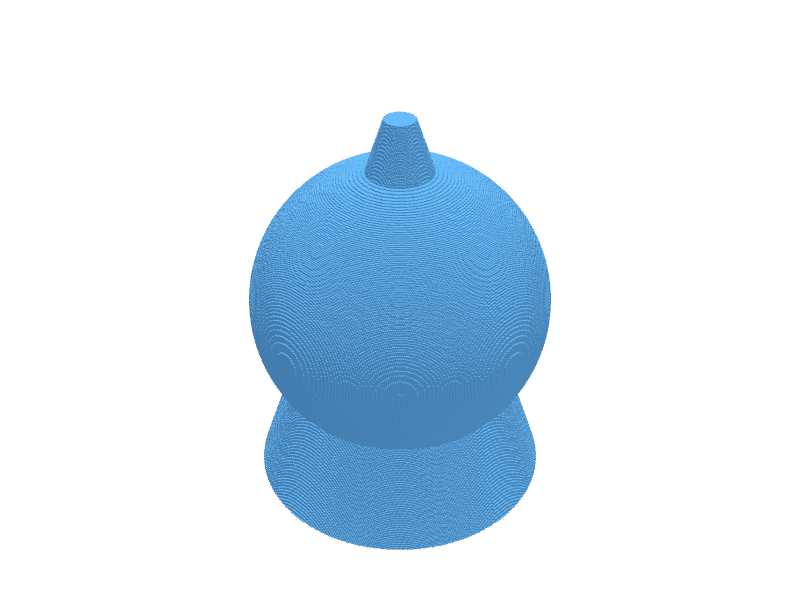

# VoxelCAD

Pythonic tools for design using numpy arrays and discrete volume elements "voxels" for construction and rendering. Inspired by OpenSCAD, but addressing computational efficiencies for complex structures.

Support for mathematically defined volume structures is emphasized, setting this package apart from surface mesh based CAD tools. Rendering and operating on dense gyroid structures is relatively quick in voxel representation as we need not get bogged down in complex mesh merges. Surface mesh structures can be generated for display and export purposes.

## Gallery

| Sphere | Gyroid Cube | Gyroid & Cylinder | Cube - Sphere |
|--------|-------------|-------------------|---------------|
|  |  |  |  |

All renders produced with PyVista offscreen at resolution 256.

## Performance

VoxelCAD uses Cython kernels with OpenMP parallelism for the compute-intensive inner loops, while keeping the full Scientific Python ecosystem accessible for orchestration, visualization, and analysis.

| Operation | NumPy | Cython (parallel) | Speedup |
|-----------|-------|--------------------|---------|
| Geometry eval + pack (sphere, res=1024) | 4.7s | 80ms | 60x |
| Resample + nearest-neighbor | 160ms | 4.2ms | 38x |
| CSG boolean (same grid) | 8.7ms | 3.1ms | 2.8x |

Cython kernels stream one voxel at a time, reducing memory from ~4.6 GB (NumPy vectorized) to ~50 MB. All primitives support coordinate transforms (translate, rotate, scale) directly in Cython without falling back to NumPy.

## Quick Start: Ice Cream Cone Demo

The `examples/ice_cream_cone_demo.ipynb` notebook demonstrates the full VoxelCAD pipeline — CSG booleans, coordinate transforms, and mesh export in a few lines:



```python
from voxelcad import Sphere, Cylinder

scoop = Sphere(3)
cone = Cylinder(h=8, r1=3, r2=0.3)
scoop_up = scoop.translate([0, 0, 4])
ice_cream = scoop_up | cone

ice_cream.plot()
ice_cream.export("ice_cream.stl")
```

To run the notebook:
```bash
conda activate voxelcad
cd examples/
jupyter notebook ice_cream_cone_demo.ipynb
```

## Visuals

The following screen capture demo illustrates a basic design for mesh model export workflow:


Complex models can be created and exported for 3D printing with compact one-liners:
```python
(GyroidCube(10, res=256, center=True, lattice_param=1.0, thresh1=-0.1, thresh2=0.1) & Cylinder(h=5, r=5, center=True)).export("model.stl")
```

The following image is of the part made with a Formlabs Form3 SLA 3D printer using Flexible 80A resin. The result is lightweight, compressible, and resilient.


## Installation

Setup dependencies:
```bash
conda create -n voxelcad python=3.10
conda activate voxelcad
conda install -c conda-forge pyvista ipython tqdm cython numpy
```

Install VoxelCAD (with Cython extension build):
```bash
pip install -e .
python setup.py build_ext --inplace
```

## Authors and acknowledgment
Craig Versek <cversek@gmail.com>

## License
MIT
