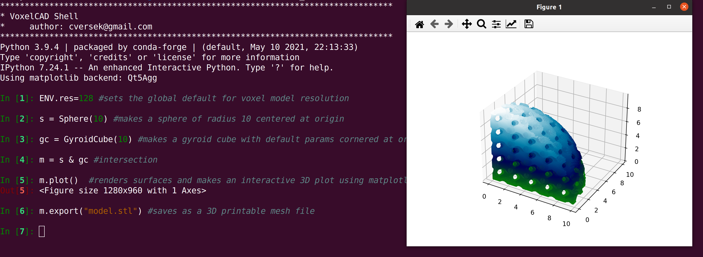
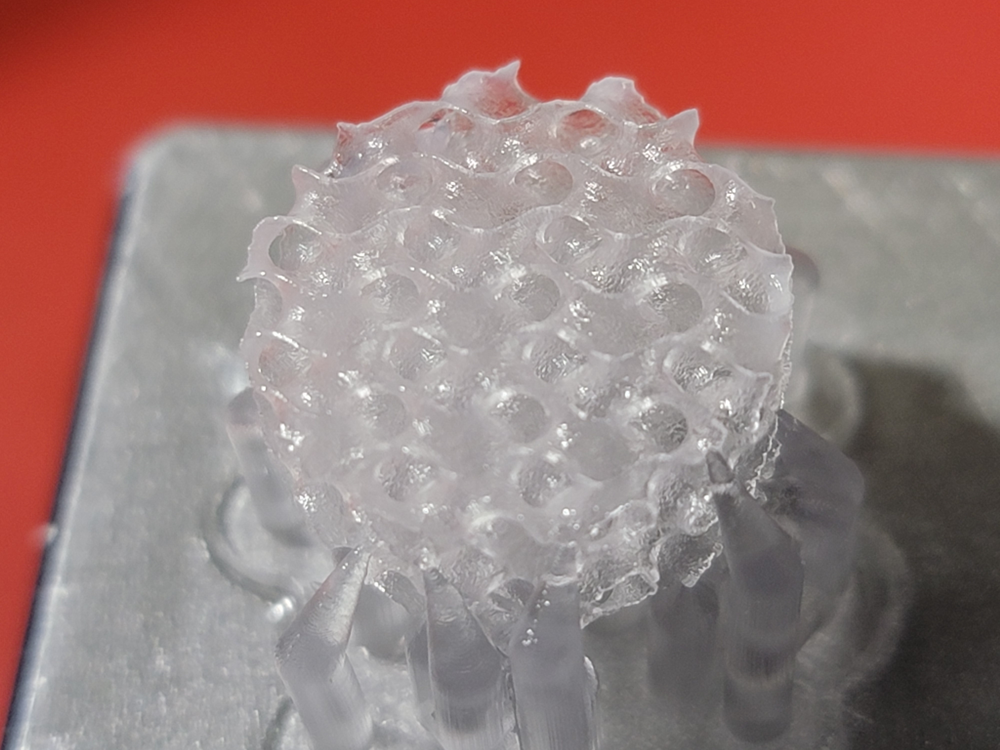

# VoxelCAD

Pythonic tools for design using numpy arrays and discrete volume elements "voxels" for construction and rendering.  Inspired by OpenSCAD, but addressing some computational efficiencies for complex structures.

Support for mathematically defined volume structures is emphasized, setting this package apart from surface mesh based CAD tools.  For instance, rendering and operating on dense gyroid structures is relatively quick in voxel representation as we need not get bogged down in complex mesh merges.  However, building simply structured (e.g. fully solid) models with voxels is rather memory and time inefficient.  Surface mesh structures can be generated for display and export purposes.  In the future we hope to add the ability to perform more detailed operations on meshes and to switch between voxel and surface mesh representations, in order to, hopefully, permit design flows using the best of both worlds!

## Visuals
The following screen capture demo illustrates a basic design for mesh model export workflow:



Complex models can be created and exported for 3D printing with compact one-liners using the `VoxelCAD Shell`, if one so chooses.  
```python
(GyroidCube(10,res=256,center=True,lattice_param=1.0,thresh1=-0.1,thresh2=0.1) & Cylinder(h=5,r=5,center=True)).export("model.stl") #makes a gyroid cube, intersects with cylinder, exports as STL
```

The following image is of the part made with a Formlabs Form3 SLA 3D printer using Flexible 80A resin.  The result is lightweight, compressible, and resilient.



## Installation with Conda Environment
Setup dependencies:
```
conda create -n voxelcad
conda activate voxelcad
conda install -c conda-forge pyvista ipython tqdm
```
In package root with `setup.py` file:
```
pip install -e .

```
Note, as of 2023-07-19 the dependency `pymeshfix` is broken in conda supported releases up to `0.16.1`, so we can get from the source repo:
```
git clone https://github.com/pyvista/pymeshfix.git
cd pymeshfix
git checkout v0.16.2
pip install -e .
``` 

## Authors and acknowledgment
"Craig Versek" <cversek@gmail.com>

## License
MIT
