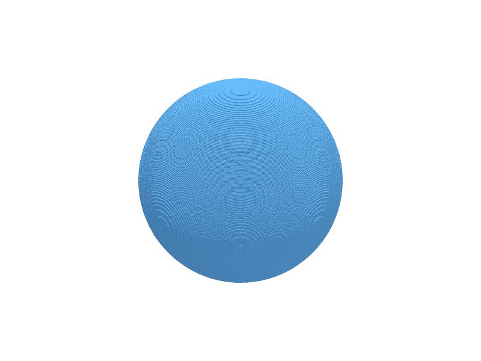
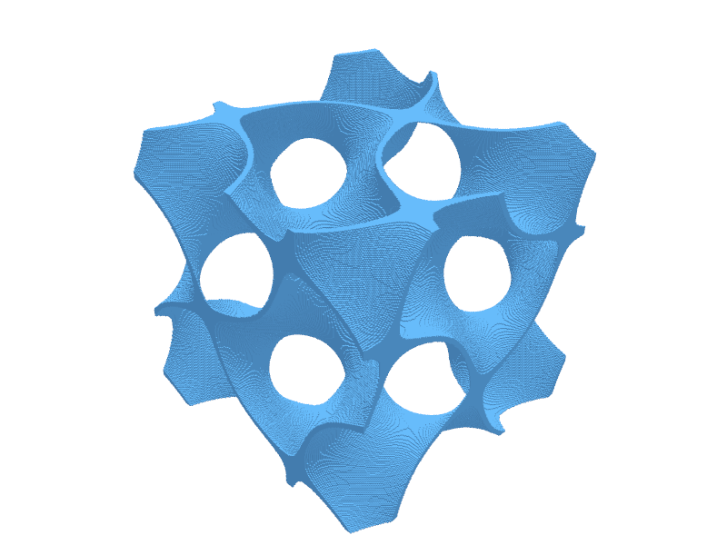
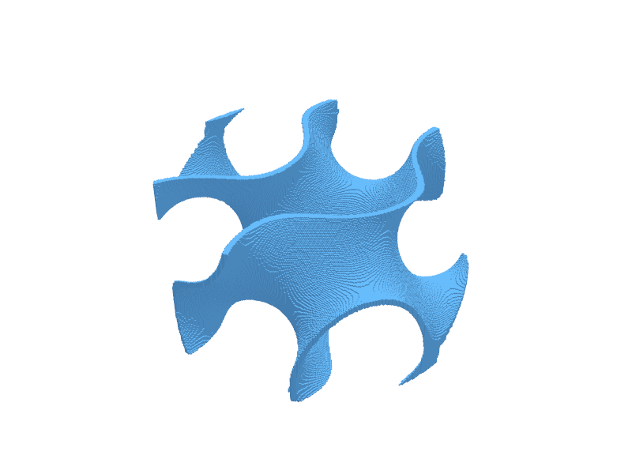
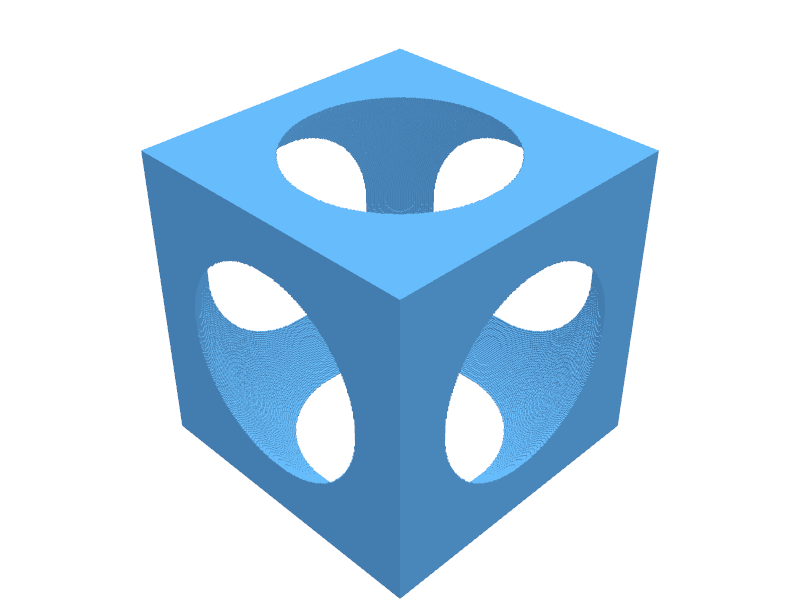
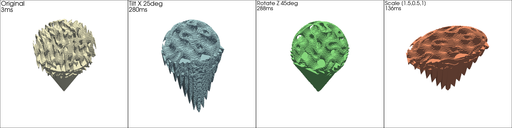

# VoxelCAD

Voxel-based 3D modeling in Python. Design with boolean operations, export to STL for 3D printing.

VoxelCAD represents geometry as packed boolean arrays instead of surface meshes. This makes complex structures — gyroids, lattices, intersections of implicit surfaces — as easy to combine as simple primitives. No mesh merges, no manifold repair, no topology headaches.

## Gallery

| Sphere | Gyroid Cube | Gyroid & Cylinder | Cube - Sphere |
|--------|-------------|-------------------|---------------|
|  |  |  |  |

All renders produced with PyVista offscreen at resolution 256.

## Quick Start: Ice Cream Cone Demo

The `examples/ice_cream_cone_demo.ipynb` notebook demonstrates the full VoxelCAD pipeline — CSG booleans, gyroid textures, coordinate transforms, and mesh export:



```python
from voxelcad import Sphere, Cylinder, GyroidCube

# Gyroid-textured scoop — the headline feature
sphere = Sphere(r=3)
gyroid = GyroidCube(size=6, center=True)
scoop = sphere & gyroid  # CSG intersection gives organic texture

cone = Cylinder(h=8, r1=0, r2=3, center=True)
scoop_up = scoop.translate([0, 0, 4])
ice_cream = cone | scoop_up

ice_cream.plot()
ice_cream.export("ice_cream.stl")
```

## Features

- **Smoothed mesh export**: VoxelCAD's STL pipeline converts voxel geometry into clean, smooth triangle meshes without the stairstep artifacts typical of voxel-based models. A signed distance field and frequency-domain Butterworth filter remove high-frequency staircase noise while preserving geometric detail, producing fairly regular triangle meshes suitable for 3D printing and simulation. No external mesh repair tools needed — the pipeline is self-contained and streams directly from packed voxel data to binary STL.
- **Boolean operations**: union (`|`), intersection (`&`), difference (`-`), XOR (`^`), inversion (`~`) with three-tier dispatch — byte-level bitwise ops for same-grid operands, grid-compatible render path, and full CSG tree evaluation with query planning
- **Transforms**: translate, rotate, scale — composable, lazy, applied at render time via inverse transform matrices
- **Primitives**: Sphere, Cube, Cylinder (with taper), GyroidCube, WigglyGyroidCube, HyperWigglyGyroidCube
- **Packed storage**: 8x memory reduction (1 GB bool → 128 MB uint8 at 1024^3)

### Planned features

- **Intelligent triangle merging**: Coplanar and near-coplanar triangle consolidation to produce compact mesh models for resource-constrained applications (embedded viewers, web, mobile)

## Visuals

The following screen capture demo illustrates a basic design for mesh model export workflow:


Complex models can be created and exported for 3D printing with compact one-liners:
```python
(GyroidCube(10, res=256, center=True, lattice_param=1.0, thresh1=-0.1, thresh2=0.1) & Cylinder(h=5, r=5, center=True)).export("model.stl")
```

The following image is of the part made with a Formlabs Form3 SLA 3D printer using Flexible 80A resin. The result is lightweight, compressible, and resilient.


## Performance

Cython kernels with OpenMP parallelism fuse geometry evaluation, thresholding, and bit-packing into a single pass. No intermediate arrays.

*Benchmarked on Apple M3 Max (12 P-cores, 36 GB RAM):*

| Operation | NumPy | Cython (parallel) | Speedup |
|-----------|-------|--------------------|---------|
| Geometry eval + pack (sphere, 1024^3) | 4.7 s | 80 ms | 60x |
| Resample + nearest-neighbor | 160 ms | 4.2 ms | 38x |
| CSG boolean (same grid) | 8.7 ms | 3.1 ms | 2.8x |

Memory: ~50 MB peak (Cython streaming) vs ~4.6 GB (NumPy vectorized).

## Installation

```bash
pip install -e ".[viz,dev]"
python setup.py build_ext --inplace
```

The second command compiles Cython extensions for 10-60x speedup. Without it, VoxelCAD falls back to NumPy with a warning.

**Requirements**: Python 3.9+, NumPy. Optional: Cython (10-60x speedup), PyVista (visualization), scipy (CDT fallback).

## Documentation

**User Guide**:
- [Getting Started](docs/user/getting-started.md) — First model, rendering, export
- [Geometry Catalog](docs/user/geometry-catalog.md) — All primitives with examples
- [Boolean Operations](docs/user/boolean-operations.md) — Union, intersection, difference, XOR
- [Transforms](docs/user/transforms.md) — Translate, rotate, scale, chaining
- [Performance Guide](docs/user/performance-guide.md) — Resolution selection, Cython acceleration
- [Troubleshooting](docs/user/troubleshooting.md) — Common issues and fixes

**Developer Guide**:
- [Extension Guide](docs/developer/extension-guide.md) — Adding new primitives and operations
- [Testing Strategy](docs/developer/testing-strategy.md) — Test organization and running
- [Build System](docs/developer/build-system.md) — Cython compilation, packaging

**Architecture Guide**:
- [Optimization System](docs/architecture/optimization-system.md) — 3-tier dispatch, fallback paths
- [Storage Format](docs/architecture/storage-format.md) — Packed boolean arrays, memory layout
- [Query Planner](docs/architecture/query-planner.md) — CSG operation optimization
- [Memory Model](docs/architecture/memory-model.md) — Streaming vs vectorized allocation
- [GPU Design](docs/architecture/gpu-design.md) — Future GPU acceleration roadmap

## Authors and acknowledgment

Craig Wm. Versek <cversek@gmail.com>

## License

MIT
