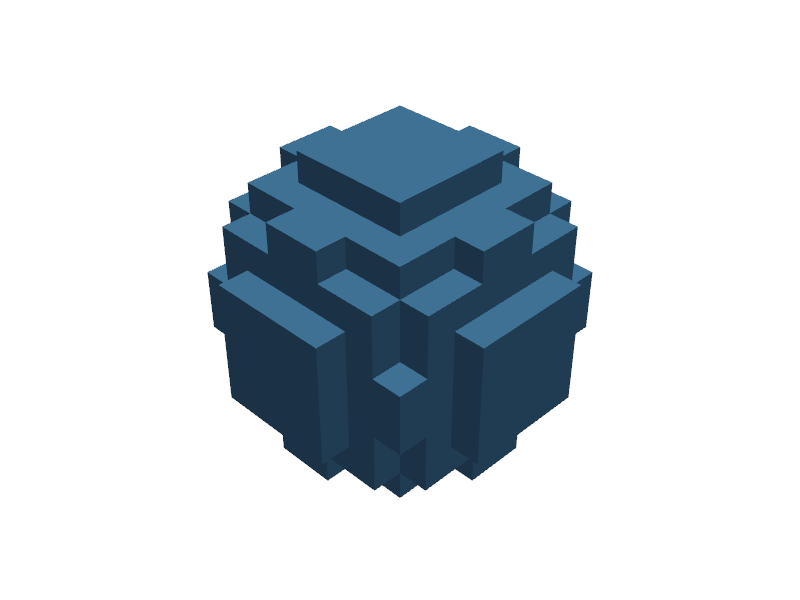
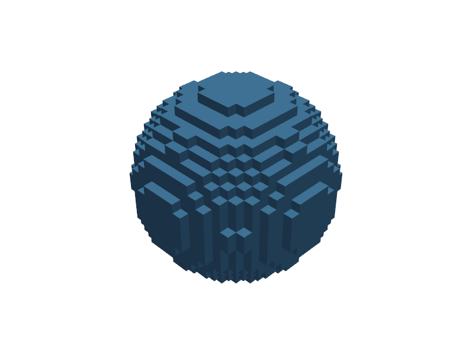
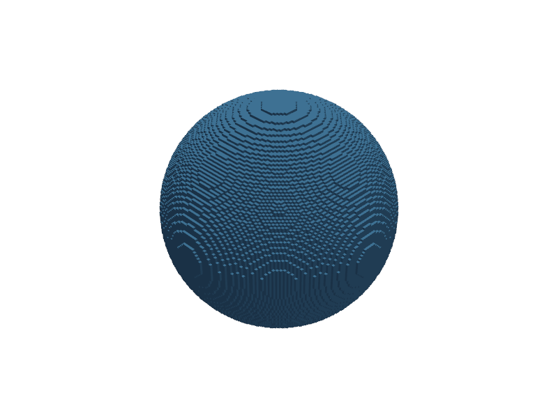

# Performance Guide

## Resolution Selection

`voxel_size` is the single biggest performance lever. Halving it multiplies memory by 8x and render time by ~8x.

| voxel_size | Grid (r=5 sphere) | Packed memory | Cython render |
|------------|-------------------|---------------|---------------|
| 1.0 | 10^3 | <1 KB | <1 ms |
| 0.5 | 20^3 | <1 KB | <1 ms |
| 0.1 | 100^3 | 122 KB | ~5 ms |
| 0.05 | 200^3 | 977 KB | ~30 ms |
| 0.01 | 1000^3 | 119 MB | ~1 s |
| 0.005 | 2000^3 | 954 MB | ~10 s |

The visual difference between resolutions:

```python
from voxelcad import Sphere

coarse = Sphere(r=5, voxel_size=1.0)
medium = Sphere(r=5, voxel_size=0.5)
fine = Sphere(r=5, voxel_size=0.1)
```

| voxel_size=1.0 | voxel_size=0.5 | voxel_size=0.1 |
|:--------------:|:--------------:|:--------------:|
|  |  |  |

Start coarse (`voxel_size=0.5`) for iteration. Increase for final export.

## Cython Acceleration

VoxelCAD includes Cython kernels that provide 10-60x speedups over the NumPy fallback. Build them after installation:

```bash
python setup.py build_ext --inplace
```

Check if they're active:

```python
from voxelcad.environment import ENV
print(ENV.use_cython)  # True if compiled, False if fallback
```

If Cython isn't compiled, VoxelCAD still works - it falls back to NumPy with a warning on first use.

### Force NumPy Fallback

For debugging or comparison:

```python
from voxelcad.environment import ENV
ENV.use_cython = False
```

## Memory: Packed Storage

VoxelCAD stores voxel data as packed booleans (1 bit per voxel, 8 voxels per byte). This means:

- 1024^3 grid = 128 MB (not 1 GB as a bool array)
- Boolean operations on packed data use byte-level bitwise ops
- No unpacking needed for most operations

## Boolean Operation Speed

Performance depends on grid compatibility:

| Scenario | What happens | Relative speed |
|----------|-------------|----------------|
| Same grid (same voxel_size + bounds) | Byte-level `bitwise_or/and/xor` | ~1 ms |
| Compatible grid (same voxel_size) | Render to union grid, then bitwise | ~10-100 ms |
| Different voxel_size | Full resampling + bitwise | ~100 ms - 1 s |

Keep operands at the same `voxel_size` to hit the fast path.

## Transform Performance

Transforms are lazy - they store a matrix, not a rendered result. The cost comes at render time:

- Primitives with Cython: geometry is evaluated directly in transformed coordinates (fast)
- Data-only models: nearest-neighbor resampling via Cython `resample_and_pack` kernel

Chaining multiple transforms has no extra cost. Ten chained transforms compose into one matrix multiplication.

## Large Model Tips

**Iterate at low resolution, export at high resolution:**

```python
model = complex_csg_tree(voxel_size=0.5)  # fast preview
model.plot()

# Happy with the shape? Re-create at export resolution:
model = complex_csg_tree(voxel_size=0.05)
model.export("output.stl")
```

**Monitor memory for large grids:**

At 0.005 voxel_size with a large bounding box, a single model can consume 1+ GB. Boolean operations on two such models need memory for both inputs plus the result.

**Use same-grid operands when possible:**

If you're combining many shapes, construct them all with the same `voxel_size` and overlapping bounding boxes. The same-grid fast path avoids resampling entirely.

## OpenMP Parallelism

Cython kernels use OpenMP for parallel evaluation. Thread count defaults to the number of CPU cores. On Apple Silicon, VoxelCAD uses only performance cores (P-cores) for better throughput.

To check thread usage, look for the parallel kernel dispatch in verbose output when building:

```bash
python setup.py build_ext --inplace 2>&1 | grep -i openmp
```

If OpenMP isn't available, kernels run single-threaded - still much faster than NumPy.

## STL Export Pipeline

VoxelCAD uses a fully fused Cython pipeline for STL and mesh export. Both paths share the same conv+MC backend: surface-band skip, face-layer vertex deduplication, pthread conv/MC overlap, and auto-tuned thread partitioning.

### Two Export Paths

| | Fast Path (`method='auto'`) | Precision Path (`method='cdt'`) |
|---|---|---|
| **Input** | Packed binary bits | CDT signed distance field (int8) |
| **Smoothing** | Scaled {-1,+1} + Butterworth convolution | CDT distances + Butterworth convolution |
| **Isovalue** | 0.0 only | Any value (offset surfaces) |
| **Speed** | Fastest | ~1.5-2x slower at 256+ |
| **Peak memory** | ~5 MB (streaming, no intermediate volumes) | SDF volume + ~5 MB streaming (see table below) |
| **Use case** | Standard export, 3D printing | Offset surfaces, toleranced fits |

The fast path streams directly from packed bits — peak memory is ~5 MB regardless of model size. The CDT path materializes the full signed distance field (int8, at stride resolution) before streaming it through the shared conv+MC backend. The `render_cdt_grid()` method additionally casts to float32, doubling the volume memory.

### Export Performance (GyroidCube, stride=2, 16 cores)

| Resolution | Fast STL | CDT STL | Fast Mesh | CDT Mesh | CDT SDF memory |
|------------|----------|---------|-----------|----------|----------------|
| 128^3 | 20 ms | 24 ms | 26 ms | 27 ms | 0.3 MB (int8) |
| 256^3 | 86 ms | 242 ms | 139 ms | 241 ms | 2.2 MB (int8) |
| 384^3 | 205 ms | 535 ms | 659 ms | 1019 ms | 7.2 MB (int8) |
| 512^3 | 470 ms | 997 ms | 1074 ms | 1931 ms | 17 MB (int8) |

CDT SDF memory = `(ceil(res/stride) + 2)^3` bytes (int8). For `render_cdt_grid()`, double these values (float32 output). The fast path uses ~5 MB peak regardless of resolution.

At 128^3, the CDT path is essentially free. At larger scales, the overhead is primarily from conservative surface-band detection in the CDT path (all cells processed), not the CDT computation itself.

### Export Parameters

```python
model.export("output.stl",
    method='auto',        # 'auto', 'fast_smooth', or 'cdt'
    mc_stride=2,          # subsample factor (2 = half resolution MC)
    isovalue=0.0,         # surface offset (CDT only, in mm)
    lowpass_cutoff=0.25,  # Butterworth cutoff (cycles/voxel)
    lowpass_order=4,      # Butterworth filter order
    compute_normals=False, # include face normals in STL
)
```

`mc_stride=2` is the default and recommended for most use cases. It halves the MC grid resolution (8x fewer cells) while preserving surface quality thanks to the Butterworth low-pass filter whose cutoff (0.25 cycles/voxel) matches the stride-2 Nyquist frequency.

### CDT Distance Field

For advanced workflows, access the distance field directly:

```python
from voxelcad._kernels import compute_cdt_field

# Float32 distances in mm
cdt = compute_cdt_field(model.voxel_data, *model.grid.res_vector,
                        stride=2, voxel_size=model.grid.voxel_size_vector)

# Or as a PyVista volume for visualization
grid = model.render_cdt_grid(mc_stride=2)
contours = grid.contour([0.0, 0.5, 1.0], scalars='cdt_distance')
```
