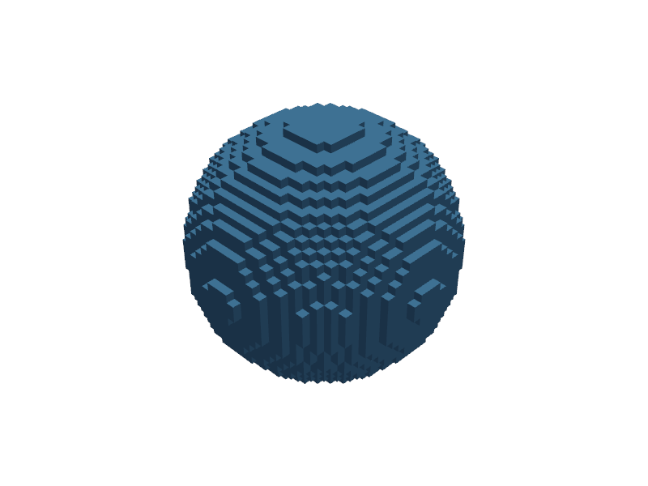
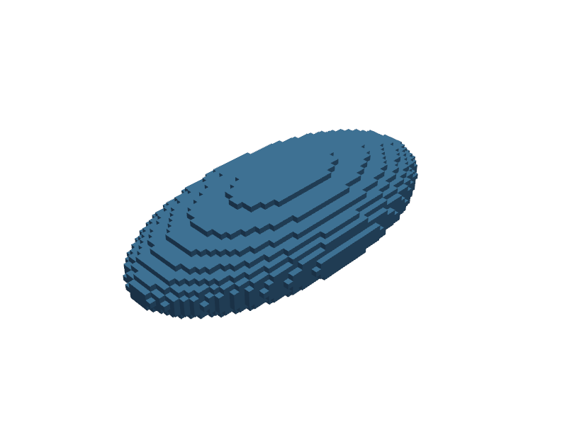
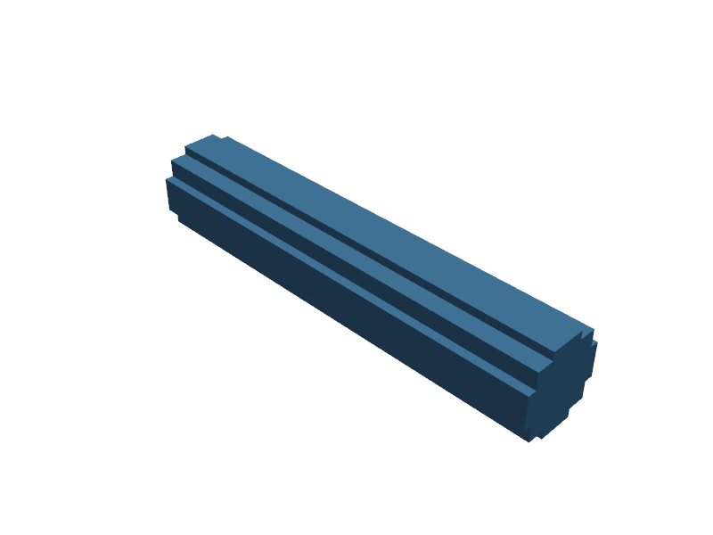
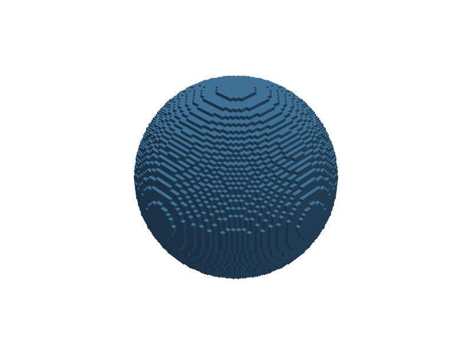
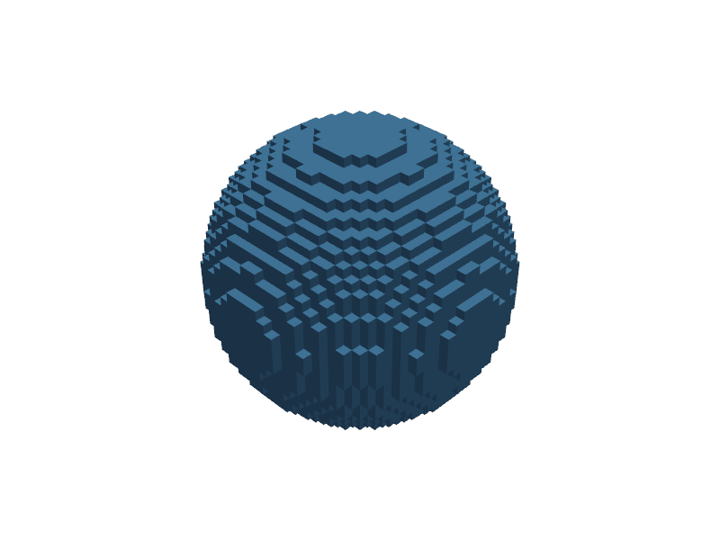
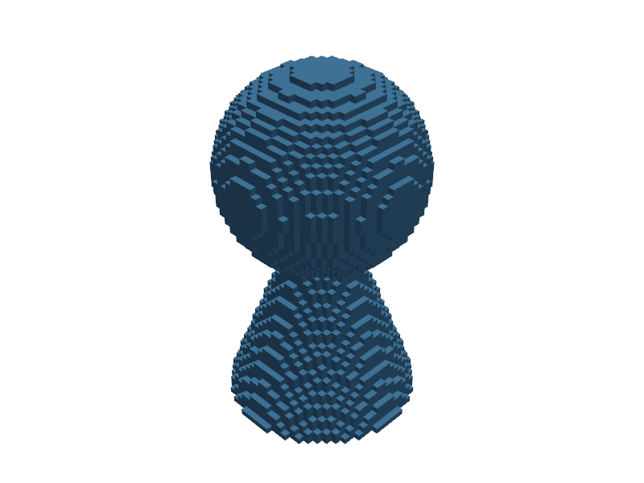
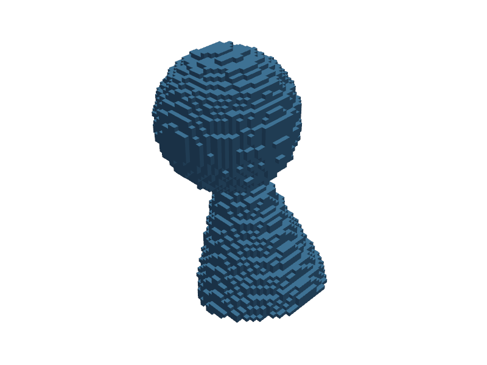
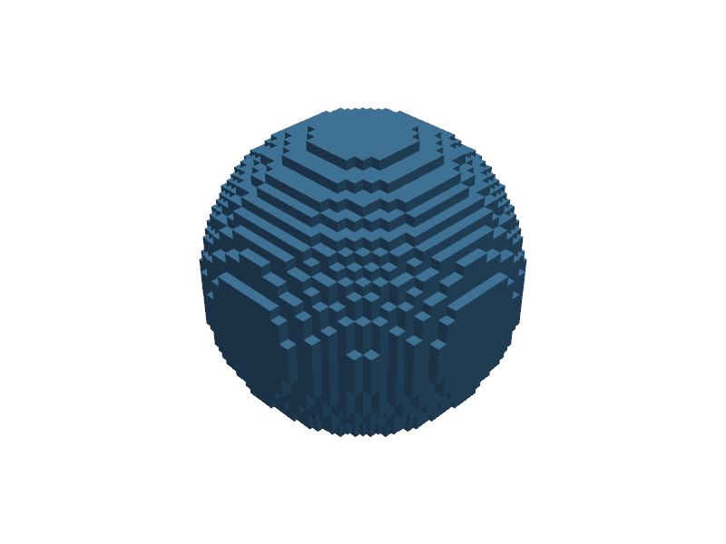
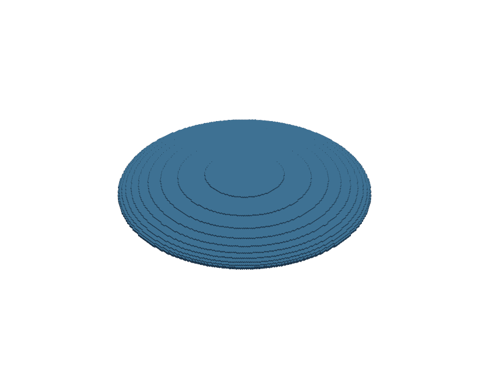

# Transforms

Move, rotate, and scale models after construction. All transform methods return a new `TransformedModel` - the original is unchanged.

## Methods

| Method | Arguments | Description |
|--------|-----------|-------------|
| `translate(v)` | `v`: [x, y, z] | Shift position |
| `rotate_x(deg)` | `deg`: float | Rotate around X axis |
| `rotate_y(deg)` | `deg`: float | Rotate around Y axis |
| `rotate_z(deg)` | `deg`: float | Rotate around Z axis |
| `scale(v)` | `v`: float or [sx, sy, sz] | Uniform or per-axis scale |

## Basic Usage

```python
from voxelcad import Sphere, Cylinder

s = Sphere(r=3, voxel_size=0.2)
moved = s.translate([0, 0, 10])     # shift 10 units along Z
rotated = s.rotate_z(45)            # 45 degrees around Z
scaled = s.scale([2, 1, 0.5])       # stretch X, squash Z
uniform = s.scale(2.0)              # double all axes
```

| Translated | Rotated | Scaled | Uniform scale |
|:----------:|:-------:|:------:|:-------------:|
|  |  |  |  |

All angles are in degrees.

## Chaining

Transforms chain left-to-right. Each call composes into a single 4x4 matrix - no intermediate rendering:

```python
arm = Cylinder(h=10, r=1, voxel_size=0.2)

# Rotate, then move into position
placed = arm.rotate_x(90).translate([5, 0, 0])
```



The order matters. `rotate then translate` puts the rotated object at (5,0,0). `translate then rotate` rotates the already-displaced object around the origin.

```python
# These produce different results:
a = arm.rotate_z(45).translate([5, 0, 0])   # rotate in place, then shift
b = arm.translate([5, 0, 0]).rotate_z(45)   # shift first, then orbit around origin
```

## Lazy Evaluation

Transforms don't render immediately. They store a matrix and evaluate when you call `plot()`, `export()`, or `render_volume()`. This means chaining many transforms is cheap:

```python
model = Sphere(r=2, voxel_size=0.1)
result = model.translate([1,0,0]).rotate_z(30).scale(1.5).translate([0,5,0])
# No computation until:
result.plot()
```



## Transforms + Booleans

Transforms and booleans compose freely:

```python
from voxelcad import Sphere, Cylinder

# Ice cream cone
scoop = Sphere(r=3, voxel_size=0.2)
cone = Cylinder(h=8, r1=3, r2=0, voxel_size=0.2)

scoop_up = scoop.translate([0, 0, 8])    # lift scoop above cone
ice_cream = scoop_up | cone               # combine
tilted = ice_cream.rotate_x(15)           # tilt the whole thing
```

| Scoop raised | Ice cream cone | Tilted |
|:------------:|:--------------:|:------:|
|  |  |  |

## Arbitrary Rotation

For rotations around an arbitrary axis, use `rotate()`:

```python
model = Sphere(r=3, voxel_size=0.2)
rotated = model.rotate([1, 1, 0], 45)  # 45 degrees around the (1,1,0) axis
```



The axis vector is normalized internally.

## Scale Caveats

Non-uniform scaling changes voxel aspect ratios. At extreme ratios (e.g., `scale([10, 1, 1])`), the resampled result may show staircase artifacts along the stretched axis. Increase resolution to compensate:

```python
# Thin disk: scale a sphere flat along Z
disk = Sphere(r=5, voxel_size=0.05).scale([1, 1, 0.1])
```


